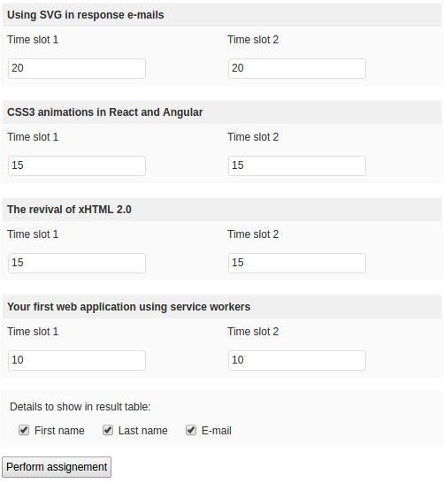
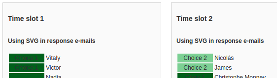

# j-p
`j-p` is a combinatorial optimization program to assign conference attendees to
prefered workshops written in PHP and interfaced as a WP plugin.

## Example
Suppose you organize a web development conference over 2 days with 5 workshops:

1. Using SVG in response e-mails (20 places)
2. CSS3 animations in React and Angular (15 places)
3. The revival of xHTML 2.0 (15 places)
4. Your first web application using service workers (10 places)
5. Audio Context API and cookieless tracking (10 places)

All workshops happen simultaneously, but are repeated the second day to give
everyone a chance to participate to two of them.

All attendees assign an order of preference for each workshop:

1. Sara wants to participate to workshop 3, 4 and 2 in order of preference
2. Nicolás wants to participate to workshop 2, 1 and 3 in order of preference
3. Vitaly wants to participate to workshop 1, 2 and 3 in order of preference
4. etc

The question is: how to assign people to workshops in order to optimize the
global satisfaction of all attendees?

This a variant of the [assignement problem](https://en.wikipedia.org/wiki/Assignment_problem).
The program solves this problem by using the Hungarian Algorithm.

## Screenshots
### Assigning number of available places for each workshop and time slot

### Result table after assignement was performed

